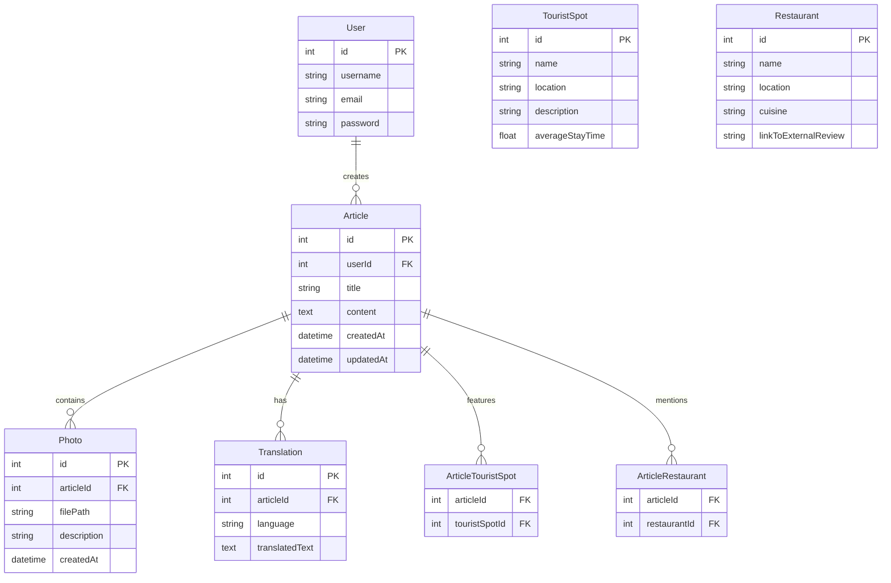

# ER図 - VoyageVista
&nbsp;
# 作成記録
---
* 作成日時 2024/3/3 野田大一郎
* 更新日時
&nbsp;
# 概要
---
* このドキュメントはVoyageVistaプロジェクトのER図である。
&nbsp;
# 対象読者
---
* このドキュメントはVoyageVistaプロジェクトのER図を確認したいエンジニア用である。
&nbsp;
# 目的
---
* VoyageVistaプロジェクトのER図を記載する。
&nbsp;

# 内容
---
ER図をmermaid形式で作成します。このER図は、主に以下の要素に焦点を当てます：

- **ユーザー**（日本人側が海外の人にPRページを作成する機能）
- **記事**（PRページ、観光地情報、飲食店情報など）
- **写真**
- **翻訳**（記事の各国語への翻訳）
- **観光地**（観光地ごとの情報）
- **飲食店情報**（外部連携を想定）

ER図では、これらの要素がどのように関連しているかを示します。ユーザーは複数の記事を作成でき、記事は複数の写真を持つことができます。また、記事は特定の観光地や飲食店に関連付けられ、それぞれの記事は複数の翻訳を持つことができます。

このER図は、提案されたシステムのデータモデルの基本を示しています。モジュール間の接続や、外部サービス（例えば飲食店のレビューサイト）との連携については、システムの具体的な実装やAPI設計に依存します。また、ユーザーの認証情報や、翻訳された記事の言語など、詳細な属性はプロジェクトの要件に応じて調整することができます。

この設計では、`ArticleTouristSpot` と `ArticleRestaurant` が中間テーブルとして機能し、`Article` と `TouristSpot`、`Restaurant` の間の多対多の関連を表現しています。各中間テーブルは、関連付けられた `Article` のIDと `TouristSpot` または `Restaurant` のIDを持ちます。これにより、一つの記事が複数の観光地や飲食店に言及でき、また一つの観光地や飲食店が複数の記事に登場することが可能になります。

