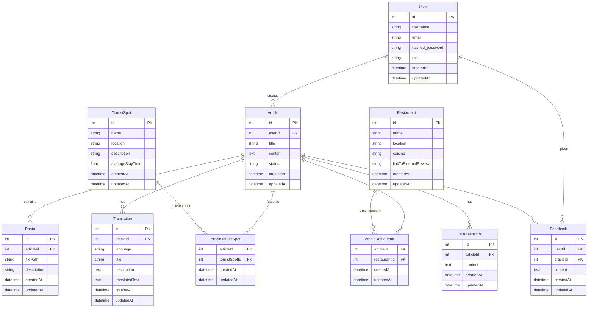

# ER図・テーブル定義書 - VoyageVista
&nbsp;
# 作成記録
---
* 作成日時 2024/3/3 野田大一郎
* 更新日時 2024/3/9 野田大一郎
&nbsp;
# 概要
---
* このドキュメントはVoyageVistaプロジェクトのER図・テーブル定義書である。
&nbsp;
# 対象読者
---
* このドキュメントはVoyageVistaプロジェクトのER図・テーブル定義書を確認したいエンジニア用である。
&nbsp;
# 目的
---
* VoyageVistaプロジェクトのER図・テーブル定義書を記載する。
&nbsp;

# 内容
---
# ER図
ER図の説明:
このER図は、ユーザーが記事を作成し、その記事に写真、翻訳、関連する観光地、関連する飲食店、文化的な洞察を追加できるシステムを表しています。また、ユーザーは記事にフィードバックを与えることができます。

1. Userテーブル：システムのユーザーを表します。ユーザーは複数の記事を作成し、複数のフィードバックを与えることができます。
2. Articleテーブル：ユーザーが作成する記事を表します。各記事は、写真、翻訳、関連する観光地、関連する飲食店、文化的な洞察を持つことができます。また、記事はフィードバックを受け取ることができます。
3. Photoテーブル：記事に含まれる写真を表します。
4. Translationテーブル：記事の翻訳を表します。各翻訳は、特定の言語で記事のタイトル、説明、本文を持ちます。
5. TouristSpotテーブル：観光地を表します。
6. Restaurantテーブル：飲食店を表します。
7. ArticleTouristSpotテーブル：記事と観光地の多対多の関係を表す中間テーブルです。
8. ArticleRestaurantテーブル：記事と飲食店の多対多の関係を表す中間テーブルです。
9. Feedbackテーブル：ユーザーが記事に与えるフィードバックを表します。
10. CulturalInsightテーブル：記事に関連する文化的な洞察を表します。

# テーブル定義書

1. Userテーブル:

| カラム名 | データ型 | 制約 | 説明 |
|----------|----------|------|------|
| id | INT | PRIMARY KEY | ユーザーID |
| username | VARCHAR | NOT NULL | ユーザー名 |
| email | VARCHAR | NOT NULL, UNIQUE | メールアドレス |
| hashed_password | VARCHAR | NOT NULL | パスワード |
| role | VARCHAR | NOT NULL | ユーザーの役割 |
| createdAt | DATETIME | NOT NULL | 登録日時 |
| updatedAt | DATETIME | NOT NULL | 更新日時 |

2. Articleテーブル:

| カラム名 | データ型 | 制約 | 説明 |
|----------|----------|------|------|
| id | INT | PRIMARY KEY | 記事ID |
| userId | INT | FOREIGN KEY (User.id) | 記事を作成したユーザーのID |
| title | VARCHAR | NOT NULL | 記事のタイトル |
| content | TEXT | NOT NULL | 記事の本文 |
| status | VARCHAR | NOT NULL | 記事の状態（下書き, 公開済みなど） |
| createdAt | DATETIME | NOT NULL | 作成日時 |
| updatedAt | DATETIME | NOT NULL | 更新日時 |

3. Photoテーブル:

| カラム名 | データ型 | 制約 | 説明 |
|----------|----------|------|------|
| id | INT | PRIMARY KEY | 写真ID |
| articleId | INT | FOREIGN KEY (Article.id) | 関連する記事のID |
| filePath | VARCHAR | NOT NULL | 写真のファイルパス |
| description | VARCHAR | | 写真の説明 |
| createdAt | DATETIME | NOT NULL | 登録日時 |
| updatedAt | DATETIME | NOT NULL | 更新日時 |

4. Translationテーブル:

| カラム名 | データ型 | 制約 | 説明 |
|----------|----------|------|------|
| id | INT | PRIMARY KEY | 翻訳ID |
| articleId | INT | FOREIGN KEY (Article.id) | 関連する記事のID |
| language | VARCHAR | NOT NULL | 翻訳の言語 |
| title | VARCHAR | NOT NULL | 翻訳されたタイトル |
| description | TEXT | | 翻訳された記事の説明 |
| translatedText | TEXT | NOT NULL | 翻訳された本文 |
| createdAt | DATETIME | NOT NULL | 登録日時 |
| updatedAt | DATETIME | NOT NULL | 更新日時 |

5. TouristSpotテーブル:

| カラム名 | データ型 | 制約 | 説明 |
|----------|----------|------|------|
| id | INT | PRIMARY KEY | 観光地ID |
| name | VARCHAR | NOT NULL | 観光地名 |
| location | VARCHAR | NOT NULL | 観光地の所在地 |
| description | TEXT | | 観光地の説明 |
| averageStayTime | FLOAT | | 平均滞在時間 |
| createdAt | DATETIME | NOT NULL | 登録日時 |
| updatedAt | DATETIME | NOT NULL | 更新日時 |

6. Restaurantテーブル:

| カラム名 | データ型 | 制約 | 説明 |
|----------|----------|------|------|
| id | INT | PRIMARY KEY | 飲食店ID |
| name | VARCHAR | NOT NULL | 飲食店名 |
| location | VARCHAR | NOT NULL | 飲食店の所在地 |
| cuisine | VARCHAR | | 料理のジャンル |
| linkToExternalReview | VARCHAR | | 外部レビューへのリンク |
| createdAt | DATETIME | NOT NULL | 登録日時 |
| updatedAt | DATETIME | NOT NULL | 更新日時 |

7. ArticleTouristSpotテーブル:

| カラム名 | データ型 | 制約 | 説明 |
|----------|----------|------|------|
| articleId | INT | FOREIGN KEY (Article.id) | 関連する記事のID |
| touristSpotId | INT | FOREIGN KEY (TouristSpot.id) | 関連する観光地のID |
| createdAt | DATETIME | NOT NULL | 登録日時 |
| updatedAt | DATETIME | NOT NULL | 更新日時 |

8. ArticleRestaurantテーブル:

| カラム名 | データ型 | 制約 | 説明 |
|----------|----------|------|------|
| articleId | INT | FOREIGN KEY (Article.id) | 関連する記事のID |
| restaurantId | INT | FOREIGN KEY (Restaurant.id) | 関連する飲食店のID |
| createdAt | DATETIME | NOT NULL | 登録日時 |
| updatedAt | DATETIME | NOT NULL | 更新日時 |

9. Feedbackテーブル:

| カラム名 | データ型 | 制約 | 説明 |
|----------|----------|------|------|
| id | INT | PRIMARY KEY | フィードバックID |
| userId | INT | FOREIGN KEY (User.id) | フィードバックを与えたユーザーのID |
| articleId | INT | FOREIGN KEY (Article.id) | フィードバックが関連する記事のID |
| content | TEXT | NOT NULL | フィードバックの内容 |
| createdAt | DATETIME | NOT NULL | 登録日時 |
| updatedAt | DATETIME | NOT NULL | 更新日時 |

10. CulturalInsightテーブル:

| カラム名 | データ型 | 制約 | 説明 |
|----------|----------|------|------|
| id | INT | PRIMARY KEY | 文化的洞察ID |
| articleId | INT | FOREIGN KEY (Article.id) | 関連する記事のID |
| content | TEXT | NOT NULL | 文化的洞察の内容 |
| createdAt | DATETIME | NOT NULL | 登録日時 |
| updatedAt | DATETIME | NOT NULL | 更新日時 |

